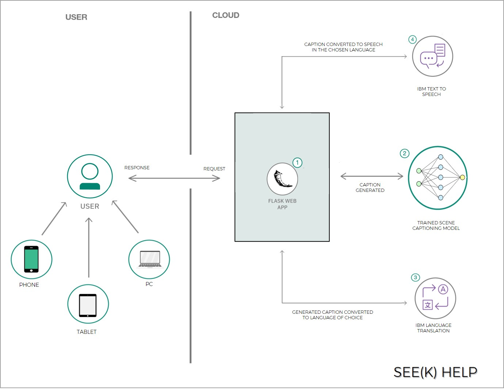

### See(k) Help - IBM Crack The Covid-19 Crisis

### A Brief Overview
The COVID-19 pandemic, a significant global health crisis, has had widespread impacts on health, economy, and society, also destabilizing the global economy. Amidst these issues, the plight of over **2.2 billion people** with visual impairments is often overlooked. Despite their vulnerability, they frequently don't receive critical support such as food, priority services, or essential care. Visually impaired people face **increased health risks** from **touching items** to read Braille labels and from extended **close contact with potentially asymptomatic helpers** in supermarkets.  

Our aim and objectives are to provide help for the visually impaired community by means of an app. We’ve created an application designed to help the blind and visually impaired identify objects they encounter in their daily lives. **Simply take a photo of anything, at any angle and you’ll hear the app identify and speak back the scene in front of you!** 

### Description
See(k) Help is an application intricately designed for the blind and the visually impaired. Be it a phone, tablet or a PC, our app utilizes the device’s camera and text-to-speech functionalities to take a picture of anything that the user points at, generate a caption of the objects in the picture and read it out loud, in the language of the user’s choice.   

Included in the solution is a **self-trained Image Captioning Model**. The dataset used to train the model is the Flickr30k Dataset. The model includes an **Inception-based CNN** to identify the objects in the frame and an **LSTM Neural Network** to generate the caption. We also use a language model, **GloVe Embeddings** to generate the caption with the correct Semantics. This ensures the result would be easily decipherable by the user, and not just a set of objects.   

A **web framework built with Flask** is used to link the API to the trained model which perceives the images and captions it. The result is sent to IBM’s Cloud based Text-To-Speech service which converts the generated caption to natural sounding audio, which is then played to the user. The inclusion of the IBM Language Translation service allows us to convert the generated caption which is in English to other languages, and then using the Text-To-Speech service, we can play the translated caption to the user.  

### Rationale
#### Flexibility
An easy to use app right at the tip of our fingers with a user-friendly interface especially designed for the blind along with Flask, which is a best in class framework. Since applications have become a major part of the digital landscape, our app is performance driven with the use of best technologies that provides maximum flexibility for all its users.

#### The Current Crisis
In the current times with the persistent crisis and with all the problems faced by the blind community, this app serves as a perfect companion to help them and guide them without any need of human intervention. This app also provides them with a sense of safety and security in these hard times.

#### Evolution in Technology
Machine learning along with Artificial Intelligence is redefining our future and with the evolution of current training algorithms, we can improve the prediction rate and accuracy over time and thus build upon the existing functions to provide additional features to assist the blind.

#### Inclusivity
See(k) Help is built on the principle of inclusivity. By failing to consider the needs of those different to ourselves, we will not be able to create a welcoming platform for everyone. After analysing the key issues at the intersection, we aim to promote and develop accessible technologies for all our users across platforms.  

### Architecture Diagram


### Screenshots
.png) 
<p align="center">Simple Layout For Easy Access</p>  


<p align="center">Available Languages</p>  

### Video Demo  
[](https://www.youtube.com/watch?v=P_XU4UL041Y)     

### Steps to Run the Project:
```
Install dependencies mentioned in requirements.txt
pip install -r requirements.txt
```

1. Download both 'inception' and 'prediction.h5' from [here](https://drive.google.com/drive/folders/1xSfaPYT7tZAN9sQZovjkeVF8jvLzmOSo)   and place them in 'models' directory.
2. Open homex.html (located in the 'run' folder) in a browser.
3. Open the text files located in 'api' folder and enter the required api keys and urls for the IBM services. Note : API keys are already included but suggested to be changed by the user during the time of running the project.
4. Run test_req.py and wait for it to deploy
5. Choose language of choice and the image to be checked.
6. After clicking on 'listen' wait for 5-10 seconds for the audio to play on the webpage.

### Model
All training files has been included in the 'models_to_train' folder, with inspiration from [Harshall Lamba](https://github.com/hlamba28/Automatic-Image-Captioning/blob/master/Automatic%20Image%20Captioning.ipynb)

[](https://opensource.org/licenses/MIT)
